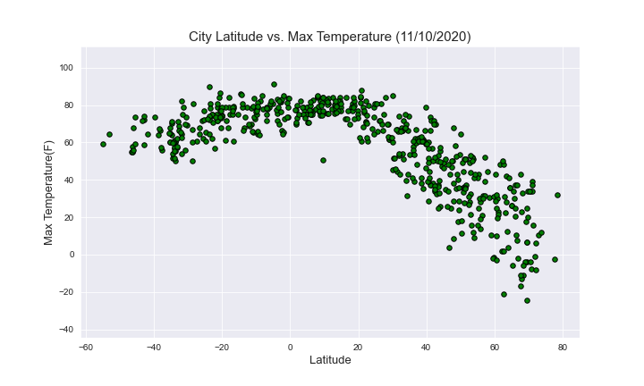
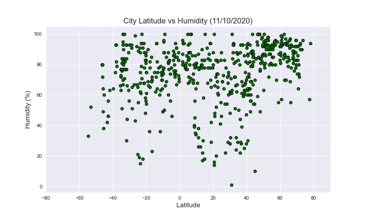
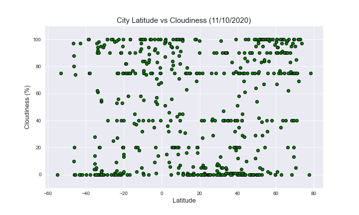
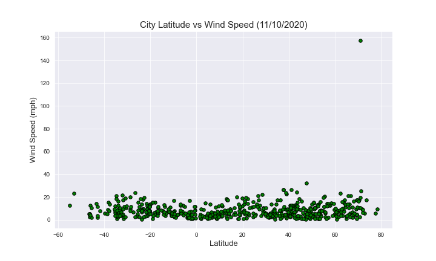

# Python-API-Challenge

**Submitted By:** Saloni Gupta\
_Date_: november, 5th, 2020\
Python API Homework - **WeatherPy**  

## Purpose  
The purpose of this project was to see how weather of 500+ unique (non-repeat) cities across the world of varying distance from the equator changes with latitude using CitiPy, a simple Python library was used to find the nearest city to each randomly generated coordinate pair and perform a weather check on each of the cities using a series of successive API calls.The OpenWeatherMap API was then used to find the current temperature, humidity, cloud cover, and wind speed for each city.   

The script accomplishes the following:  
1) Randomly selects at least 500 unique (non-repeat) cities based on latitude and longitude.  
2) Includes a print log of each city as it's being processed with the city name.  
3) Saved both a CSV of all data retrieved and png images for each scatter plot.  

The visualizations include a series of scatter plots to showcase the following relationships:  
Temperature (F) vs. Latitude | Humidity (%) vs. Latitude | Cloudiness (%) vs. Latitude | Wind Speed (mph) vs. Latitude  

Each of these parameters was plotted against the cities latitude to see how temperature varies with distance from the equator. 1500 random coordinate pairs were used to find over 500 cities to perform this analyses. The data and visualizations from this analysis can be found on this site. Click on any of the images in Images folder above to see more analysis.  

## Requirements
This notebook requires python to be installed. Python 3.8.3 was used during development. The pandas library used to store, manipulate, filter, merge and perform calculations with the data. The matplotlib and numpy libraries were used to generate the plots showing the trends of various parameters versus latitude. The citipy library was used to get the coordinate pairs used to call openweathermap api. The requests library was used to make the actual calls to the openweathermap api. The jupyter library was used to execute the python code and display results.The data analyzed, and displayed on WeatherPy jupyter notebook, and the results are exported in CSV format CityData.csv,  

We also need to create a api_keys.py file containing api keys for openweatherapi and it looks as follows:
weather_api_key="API_KEY_HERE"  

## Running the Code
To run the notebook enter the following into the command line: $ jupyter notebook Open up the WeatherPy.ipynb notebook in your browser and then click the 'Kernel' and the 'Restart and run all option'  

## Observable Trends and Insights
Not surprisingly, temperature increases as we approach the equator(Latitude 0). However, temperature peaks at around -18 and 37 degrees latitude, not exactly at the equatorial line. This may be due to the Earth's tilt in the axis.

The findings from the data, plots, in the case of testing if there is a relation between humidity and cloudiness of cities nearer or farther to the equator (latitude 0) doesn't show any significant results. The visualizations below shows a great variety of values at similar latitudes.

The finding from the analysis of the relationship between wind speed (mph), and latitude showed lower wind speed when the cities closer to the equater (latitude 0), and Wind speed appears to slightly increase as we move away from the equator. We would need to go beyond the ranged examined to make a definitive conclusion.

## Results  
After performing the API call from OpenWeatherMap API the following Cities data was retrieved and dataframe was created:  

 

## Scatter ploting  
After generating the data a series of scatter plots were created to showcase the following relationships:  

### Latitude vs. Temperature Plot  
 

The above scatter plot showcase the relationship between Latitude at x-axis vs Max Temperature (F) at the y-axis. This result indicates that there is a higher temperature for cities that found near to the equater (Latitude 0),however when you go farther from the equator towards to the north and south the temprature will decrease.  

### Humidity (%) vs. Latitude  
 

The above scatter plot displayed the relationship between Humidity (%) vs. Latitude. From this result we can infer that humidity is fairly distributed troughout the plot, so we can say that high humidity occer for both cities found farther or near to the equator.  

### Cloudiness (%) vs. Latitude  
 

The above scatter plot showed that the relationship between the cities cloudness, and latitude. From this result we can tell that the data is evenly distributed, and there is no difference in Cloudiness when the cities farther or nearer to the equator(Latitude 0)  

### Wind Speed (mph) vs. Latitude  
 

The above scatter plot showed the relationship between wind speed (mph), and latitude. The plot displayed the lower wind speed when the cities closer to the equater (latitude 0) and somehow the wind speed increase for the cities farther from the equator.

Second part of the project is to run linear regression on each relationship, only this time separating them into Northern Hemisphere (greater than or equal to 0 degrees latitude) and Southern Hemisphere (less than 0 degrees latitude):

### Northern Hemisphere - Temperature (F) vs. Latitude 
 

The r-squared is: 0.73 .The above plot is a linear regression model between Maximum tempreture and latitude for Northern Hemisphere cities. The result from the data showed that there is a strong, negative correlation between Maximum tempreture and latitude. These means when we go farther away to the north from the equater(latitude 0) the maximum Temperature (F) will decrease.

### Southern Hemisphere - Temperature (F) vs. Latitude  
 

The r-squared is: 0.384. The above scattered graph is a linear regression model between Maximum Temperature and Latitude for Southern Hemisphere cities. The result from the data showed that there is a moderate positive correlation between latitude and max temperature for southern hemisphere.

### Northern Hemisphere - Humidity (%) vs. Latitude  
  

The r-squared is: 0.096. The above plot is a linear regression model between Humidity (%) and Latitude for Northern Hemisphere cities. The result from the data showed that there is a moderate positive correlation between Humidity (%) and Latitude in the Northern Hemisphere cities.

### Southern Hemisphere - Humidity (%) vs. Latitude
 

The r-squared is : 0.0. The above plot is a linear regression model between Humidity (%) and Latitude for Southern Hemisphere cities. The result from the data showed that there is a very week positive correlation between Humidity (%) and Latitude in the Southern Hemisphere cities..

### Northern Hemisphere - Cloudiness (%) vs. Latitude
 

The r-squared is: 0.04. The above plot is a linear regression model between Cloudiness (%) and Latitude for Northern_Hemisphere cities. The result from the data showed that there is a week positive correlation between Cloudiness (%) and Latitude in the Southern Hemisphere cities.  

### Southern Hemisphere - Cloudiness (%) vs. Latitude
 

The r-squared is : 0.1. The above plot is a linear regression model between Cloudiness (%) and for Southern Hemisphere cities. The result from the data showed that there is a week positive correlation between Cloudiness (%) and Latitude in the Southern Hemisphere cities.¶

### Northern Hemisphere - Wind Speed (mph) vs. Latitude
 

The r-squared is : 0.02. The above plot is a linear regression model between Wind Speed (mph), and latitude for Northern Hemisphere cities. The result from the data showed that there is a very week positive correlation between Wind Speed (mph (%) and Latitude in the Northern Hemisphere cities.

### Southern Hemisphere - Wind Speed (mph) vs. Latitude
 

The r-squared is : 0.0. The above plot is a linear regression model between Wind Speed (mph), and latitude for Southern Hemisphere. The result from the data showed that there is a very week negative correlation between Wind Speed (mph (%) and Latitude in the Southern Hemisphere cities.
